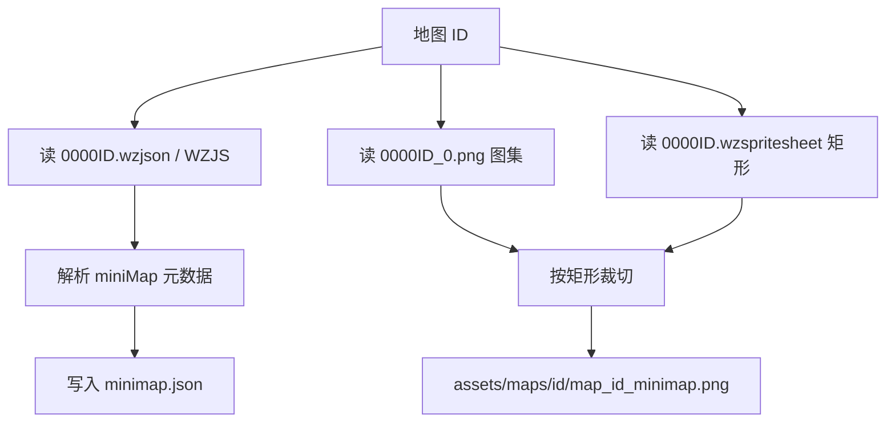

# 如何从客户端导出地图 minimap

本文说明如何从怀旧服客户端解出 **中文资源侧** 的小地图画布（minimap），对应「下不到 CMS 中文整图」时的实用路径。

## 结论摘要

| 项目 | 内容 |
|------|------|
| 示例 | 南港西郊平原 / **50001** |
| WZJS | `Json/Map/Map/Map0/000050001.wzjson` → 提供 `width/height/centerX/centerY/mag` |
| 画布像素 | `SpriteSheet/CN/Map/Map/Map0/000050001_0.png`（图集） |
| 裁切矩形 | 同目录 `000050001.wzspritesheet`（WZSS，宽高一般为 125×72，原点左下） |
| 输出 | `mxd_tools/assets/maps/{id}/map_{id}_minimap.png` |

说明：

- WZJS **不是**整段 AES 密文；字段名表与数值多为明文二进制，`miniMap/canvas` 类型为 `$spritesheetitem`，像素不在 json 内。
- 图集路径在 Addressables 里可能被压缩，脚本用 UnityPy 扫 `spritesheet_*.bundle` 的 container。
- Unity 纹理原点在**左下**，导出到 PNG 时要换成 PIL 左上坐标。

## 推荐工作流



## 脚本用法

```powershell
cd mxd_tools
pip install UnityPy Pillow
python .\scripts\extract_minimap.py 50001
python .\scripts\extract_minimap.py 50001 --out .\assets\maps\50001
```

输出文件：

- `map_{id}_minimap.png` — 小地图画布
- `map_{id}_atlas.png` — 原始图集（多为 128×128）
- `map_{id}_minimap.json` — WZJS 元数据与资源来源

## 与「下载完整地图」的关系

| 目标 | 来源 | 语言 |
|------|------|------|
| minimap 画布 | **优先本脚本（客户端 CN）**；也可 GMS `/minimap` | 客户端无木牌字问题 |
| 完整大地图 render | `scripts/extract_map_render.py`（GMS `/render` + WZJS portal/VR） | 木牌仍为英文；中文整图拼贴未完成 |
| 怪物/传送门帧 | `extract_sprites.py` | 客户端 CN |

资源根目录统一为：**`mxd_tools/assets/`**。
