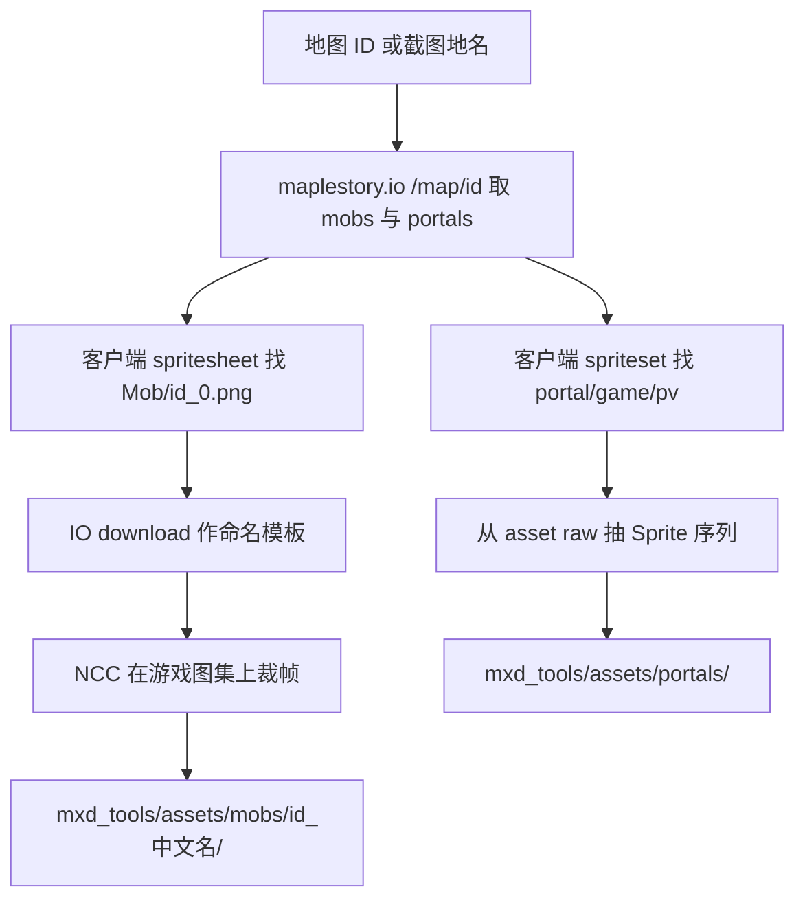

# 如何抽取怪物与传送门精灵图

本文记录「彩虹岛 · 南港西郊平原（50001）」一例的实际抽取过程，以及可复用的脚本。

与「完整地图 PNG」不同：**帧像素来自游戏客户端**，maplestory.io 只用来查 ID、动作名和参考裁切。

## 结论摘要

| 项目 | 内容 |
|------|------|
| 示例地图 | 南港西郊平原 / **50001** |
| 本图怪物 | 蓝蜗牛 `100101`、红蜗牛 `130101`、花蘑菇 `1210102`、木妖 `130100` |
| 可见出入口 | `MapHelper/portal/game/pv`（光柱门，type=2） |
| 像素来源 | 客户端 Addressables：`StreamingAssets/aa/w/spritesheet_*.bundle`、`spriteset_*.bundle` |
| 命名参考 | [maplestory.io](https://maplestory.io) `GMS/83` 的 mob download zip |
| 输出目录 | `mxd_tools/assets/mobs/`、`mxd_tools/assets/portals/` |


安装路径见仓库根目录 `安装位置.txt`。客户端 **没有** 按动作拆好的单帧 PNG；怪物是打包在图集 `_0.png` 里，元数据 `*.wzspritesheet` 多为加密（WZSS），不能直接读矩形。

## 当时用的查找步骤

### 1. 查清这张地图有哪些怪 / 哪些门

```text
GET https://maplestory.io/api/GMS/83/map/50001
```

关注字段：

- `mobs[].id` → 怪物 ID 列表  
- `portals[]` → `portalName` / `type` / `toMap`  

本例结果：

| ID | 英文名 | 中文 |
|----|--------|------|
| 100101 | Blue Snail | 蓝蜗牛 |
| 130101 | Red Snail | 红蜗牛 |
| 1210102 | Orange Mushroom | 花蘑菇 |
| 130100 | Stump | 木妖 |

可见传送点（`type=2`）示例：`west00`、`east00`、`in00`、`in01`。它们共用同一套 **pv** 光柱动画，不是每扇门一张独立图。

### 2. 在客户端里定位资源键

怪物图集（注意 ID 补零到 **7 位**）：

```text
Assets/WzAssets/SpriteSheet/CN/Mob/{id:07d}_0.png
Assets/WzAssets/SpriteSheet/CN/Mob/{id:07d}.wzspritesheet
```

例：`130100` → `0130100_0.png`；`1210102` → `1210102_0.png`。

传送门（SpriteSet，不是 SpriteSheet）：

```text
Assets/WzAssets/SpriteSet/Common/Map/MapHelper/portal/game/pv.asset
Assets/WzAssets/SpriteSet/Common/Map/MapHelper/portal/game/ph/default/...
```

在 `StreamingAssets/aa/w/` 下搜 bundle 内容即可定位：

- `spritesheet_*.bundle` 含 `Mob/{id}`  
- `spriteset_*.bundle` 含 `portal/game`

### 3. 怪物：游戏图集 + IO 命名帧 → 裁切

流程：

1. 用 UnityPy 从 bundle 读出 `{id}_0.png` 图集。  
2. 从 maplestory.io 下载同 ID 的动作 zip（`stand/0.png` 等），压平为 `stand_0.png` 作**命名模板**。  
3. 对每张模板在图集上做灰度 NCC（`cv2.matchTemplate`），一对一匹配、避免框重叠。  
4. 按匹配矩形从**游戏图集**裁出 PNG（像素以客户端为准）。

注意：

- 部分动作帧像素完全相同（例如花蘑菇 `jump_0`≡`move_1`），所以「命名帧数」可以大于「独立像素数」。  
- `*.wzspritesheet` 常读失败（加密），不要依赖它拿矩形。  
- 国服 CN 图集与 GMS/83 参考帧在本例中 NCC≈1.0；若换版本匹配变差，需要降阈值或改连通域方案。

### 4. 传送门：解析 SpriteSet 里的 Sprite 引用

`pv.asset` 等 MonoBehaviour 的 typetree 往往读不全，但 raw 里有一串指向 `Sprite` 的 path_id。按出现顺序取出 `Sprite.image` 即可导出 `pv_00.png` …。

`ph/default` 是隐身门进/停/出动画，本图可见门主要用 **pv**。

## 推荐工作流（以后照做）



1. 先确定 **地图 ID**，用 `/map/{id}` 列出怪物。  
2. 怪物：客户端图集出像素，IO zip 出文件名。  
3. 出入口：导出 `pv`；需要隐身门动画再加 `ph/default`。  
4. 不要指望安装目录里有现成的 `stand_0.png` 散文件。

## 脚本用法

依赖：

```powershell
pip install UnityPy Pillow numpy opencv-python
```

### 按怪物 ID

```powershell
cd mxd_tools
python .\scripts\extract_sprites.py --mob 130100
python .\scripts\extract_sprites.py --mob 100101 --mob 130101 --mob 1210102 --mob 130100
```

### 按地图 ID（自动抽该图全部怪 + 传送门）

```powershell
python .\scripts\extract_sprites.py --map 50001
```

### 只抽传送门

```powershell
python .\scripts\extract_sprites.py --portals
```

### 指定输出目录

```powershell
python .\scripts\extract_sprites.py --map 50001 --out assets
```

默认输出到 `mxd_tools/assets/`；IO 命名帧缓存在 `mxd_tools/tmp/extract_probe/io_mob_{id}/`。

## 本例已生成的目录

```text
mxd_tools/assets/
  mobs/
    100101_蓝蜗牛/
    130101_红蜗牛/
    1210102_花蘑菇/
    130100_木妖/
  portals/
    pv_可见传送门/          # 地图出入口光柱 8 帧
    ph_default_start/
    ph_default_continue/
    ph_default_exit/
  maps/
    50001/                  # 见「如何从客户端导出 minimap」
```

每个怪物目录含：各动作 PNG、`_atlas_from_game.png`（原图集）、`README.txt`。

## 相关接口 / 路径一览

| 用途 | 位置 |
|------|------|
| 地图怪物/传送点 | `https://maplestory.io/api/GMS/83/map/{id}` |
| 怪物元数据 | `https://maplestory.io/api/GMS/83/mob/{id}` |
| 怪物动作 zip（命名用） | `https://maplestory.io/api/GMS/83/mob/{id}/download` |
| 客户端怪物图集 | `.../aa/w/spritesheet_*.bundle` → `SpriteSheet/CN/Mob/{id:07d}_0.png` |
| 客户端传送门 | `.../aa/w/spriteset_*.bundle` → `MapHelper/portal/game/pv.asset` |
| 安装路径备忘 | 仓库根目录 `安装位置.txt` |

## 与「下载完整地图」文档的分工

| 目标 | 做法 | 文档 |
|------|------|------|
| 小地图画布 / 整图渲染 | 只走 maplestory.io `/minimap` `/render` | `如何查找并下载完整地图.md` |
| 怪物帧、传送门光柱 | 客户端出像素 + IO 辅助命名 | 本文 |
